# Member_Board_REST-API [](https://app.travis-ci.com/min9288/Member_Board_REST-API)
> 회원과 게시판 기능이 있는 애플리케이션 서버입니다.
> 
> 과금으로 인한 서버 종료로, 클라우드 계정 변경 및 포인트 적립/상품결제 기능을 추가할 예정입니다.


</br>

## 서비스 개요
> REST API 기반의 게시판 기능 구현 서버입니다.


</br>

## 서비스 주요기능
- 회원
  - 회원정보는 아이디, 이메일, 비밀번호, 닉네임으로 구성됩니다.
  - 아이디는 UUID로 구성되며, 인덱스를 대신하며 고유성을 유지합니다.
  - 회원가입은 중복가입을 방지하기 위해 이메일 인증을 통해서 가입할 수 있습니다.
  - 로그인시 토큰이 발급되며, 일부 API를 제외하고는 토큰이 사용해서 API에 접근할 수 있습니다.
  - 회원 UUID를 가지고 내 정보를 조회할 수 있습니다.
    - 로그인한 유저 정보를 가져와서 현재 조회하려는 유저와 확인하려는 유저와 동일한지 검증 후 조회를 할 수 있습니다.

</br>

- 게시판
  - 로그인한 회원만 게시판에 접근할 수 있습니다.
    - 토큰을 통해 API에 접근하기 때문에 로그인한 회원만 게시판에 접근 할 수 있습니다.
  - 로그인한 회원은 게시판에 글을 작성할 수 있습니다.
  - 작성한 글을 본인만 볼 수 있게 "잠금설정" 할 수 있습니다.
    - 게시글 작성 및 수정시 PUBLIC_BOARD / PRIVATE_BOARD로 해당 게시글을 잠금 설정 할 수 있습니다.
    - 게시글 전체조회시 PRIVATE_BOARD를 제외한 PUBLIC_BOARD만 노출됩니다.
    - 내가 작성한 전체 게시글을 확인 할 때는 잠금유무 상관없이 게시글들을 확인 할 수 있습니다.
    - 게시글 상세 조회시에는, 게시글이 PRIVATE_BOARD라면 본인만 확인이 가능합니다.
    - 게시글 상세 조회 후 해당 게시글의 조회수가 1 증가됩니다.
  - 작성한 글을 수정할 수 있습니다.
    - 로그인한 유저 정보를 가져와서 현재 수정하려는 유저와 게시글 작성자와 동일한지 검증 후 수정이 처리 됩니다.
  - 작성한 글을 삭제할 수 있습니다.
    - 로그인한 유저 정보를 가져와서 현재 삭제하려는 유저와 게시글 작성자와 동일한지 검증 후 삭제가 처리 됩니다.


</br>

## 기술 스택
- Spring Boot (API Server)
- Spring Security (Security)
- JPA & QueryDSL (ORM)
- MySQL (8.0 / Naver Cloud DB) (RDB)
- AWS EC2 (Infra)
- AWS S3 (Build Store)
- Travis CI & AWS Codedeploy (CI/CD)
- Nginx (Reverse Proxy Server)
- Postman (Documentation)
- DBeaver (Database tool)
- IntelliJ (Development tool)

</br>

## 가용 서버
- ~3.39.20.133~
  - ~실 사용은 위 서버로 진행할 수 있습니다.~
  -  과금 문제로 현재 서버가 내려간 상태입니다.

</br>

## 기능 및 사용방법
> JWT를 적용하여 일부 API를 제외하고는 토큰을 통해 접근 할 수 있습니다.

> 토큰 없이 접근가능한 API는 다음과 같습니다.
> - "/sing/**" - 가입 / 로그인 / 토큰 재발행 / 이메일 인증
> - "/exception/**" - 예외처리
> - "/profile" - 작동되고 있는 서버 프로필 확인 
> - "/actuator/**" - 애플리케이션 상태 확인
> - "/test" - 테스트

<br/>

### 테스트 계정
```bash 
* email 
  - min9288@gmail.com 
  - wjdalsdnchlr@naver.com
  - alsdn_88@hanmail.net

* password : 1234
```

<br/>

### 회원가입
  
```bash 
Post
* 회원가입 : 3.39.20.133/sign/register
{
    "email" : "이메일주소",
    "password" : "패스워드",
    "nickname" : "닉네임"
}
```
<p align="center">
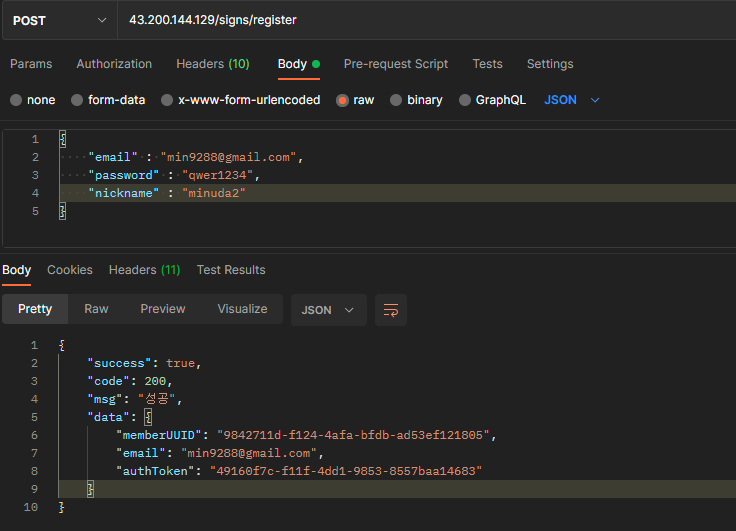
</p>

> * 3가지 정보로 간단한 회원가입을 구현했습니다.
> * 회원가입 후 이메일 인증을 진행해야 정상적으로 로그인이 됩니다.
> * 이메일 미 인증 후 로그인 시 이메일 인증을 해야된다는 오류 메시지가 전달됩니다.

<br/>

### 이메일 인증
  
```bash 
Get
* 이메일 인증 : 3.39.20.133/sign/confirm-email?email=이메일주소&authToken=엑세스토큰
* 엑세스 토큰 유효시간 : 5분
* 회원가입 시 Response 값으로 나왔던 엑세스 토큰과 이메일주소로 진행하면 됩니다.
* 인증방식 : 
  - Postman을 통한 인증방식
  - 수신받은 인증 메일을 통한 인증방식
* 2가지 방식 중 하나를 선택하시면 됩니다.
* 대략 30초 ~ 2분 내로 인증메일이 수신됩니다.

```
<p align="center">
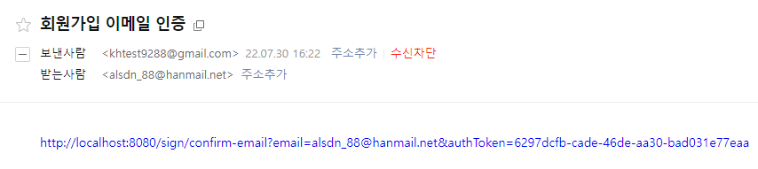
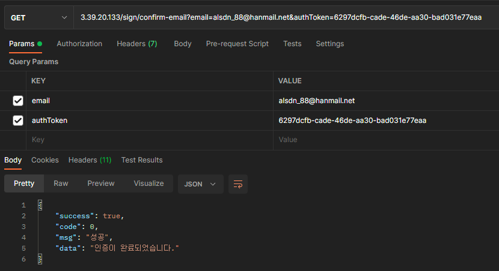
</p>

> * 3가지 정보로 간단한 회원가입을 구현했습니다.
> * 회원가입 후 이메일 인증을 진행해야 정상적으로 로그인이 됩니다.
> * 이메일 미 인증 후 로그인 시 이메일 인증을 해야된다는 오류 메시지가 전달됩니다.

<br/>

### 로그인
  
```bash 
Post
* 로그인 : 3.39.20.133/sign/login
* 엑세스 토큰 유효시간 : 30분
* 재발행 토큰 유효기간 : 7일

{
    "email" : "이메일주소",
    "password" : "패스워드"
}

```
<p align="center">
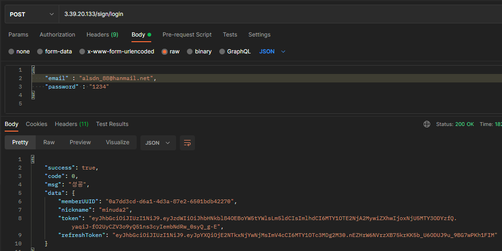
</p>

> * Response 값에 있는 토큰으로 토큰 없이 접근 가능한 API외에 다른 API들을 이용할 때 사용하시면 됩니다.
> * Response 값에 재발행 토큰 값이 있는데, 이것으로 토큰 만료 후 토큰을 재발행 할 수 있습니다.

<br/>

### 토큰 재발행
  
```bash 
Post
* 토큰 재발행 : 3.39.20.133/sign/reissue
{
    "accessToken" : "엑세스 토큰",
    "refreshToken" : "리프레시 토큰"
}

```
<p align="center">
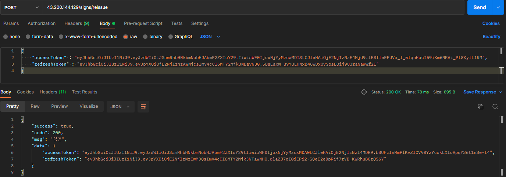
</p>

> * 토큰 재발행 시, 로그인할때 나온 Response 값(accessToken, refreshToken)으로 사용하시면 됩니다.

<br/>

### 토큰 사용 방법
  
```bash 
* 각 API의 Headers 에서 Key값과 Value값을 넣어주세요
* key : X-AUTH-TOKEN
* value : access 토큰
```
<p align="center">
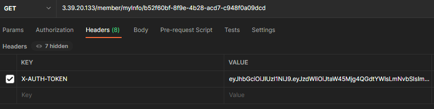
</p>

<br/>

### 내 정보 보기
  
```bash 
Get
* 내 정보 보기 : 3.39.20.133/member/myInfo/{회원UUID}
* 로그인 할때 Response 값으로 나온 memberUUID를 가지고 조회 할 수 있습니다.
```
<p align="center">
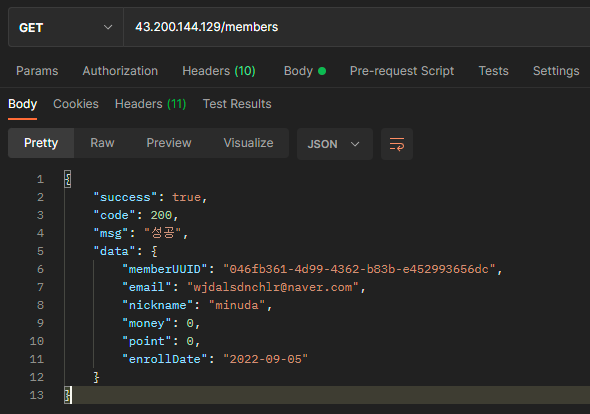
</p>

> * 지금 로그인한 회원이, 조회할려는 회원과 동일인이 아닐 경우 본인이 아니라는 경고 값이 출력됩니다.

<br/>

### 게시글 작성
  
```bash
Post 
* 게시글 작성 : 3.39.20.133/board/write
* boardStatus : PRIVATE_BOARD - 게시글 잠금 / PUBLIC_BOARD - 공개 게시글
{
    "title" : "제목",
    "contents" : "내용",
    "boardStatus" : "PRIVATE_BOARD / PUBLIC_BOARD"
}
```
<p align="center">
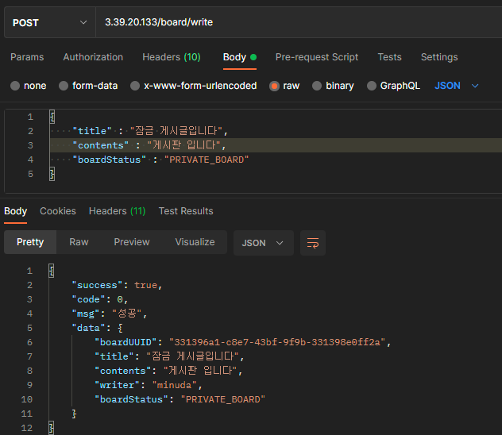
</p>

> * boardStatus를 통해 게시글을 잠금할지 공개할지 선택할 수 있습니다.

<br/>

### 게시글 전체 조회
  
```bash
Get 
* 게시글 전체 조회 : 3.39.20.133/board/getAll
```
<p align="center">
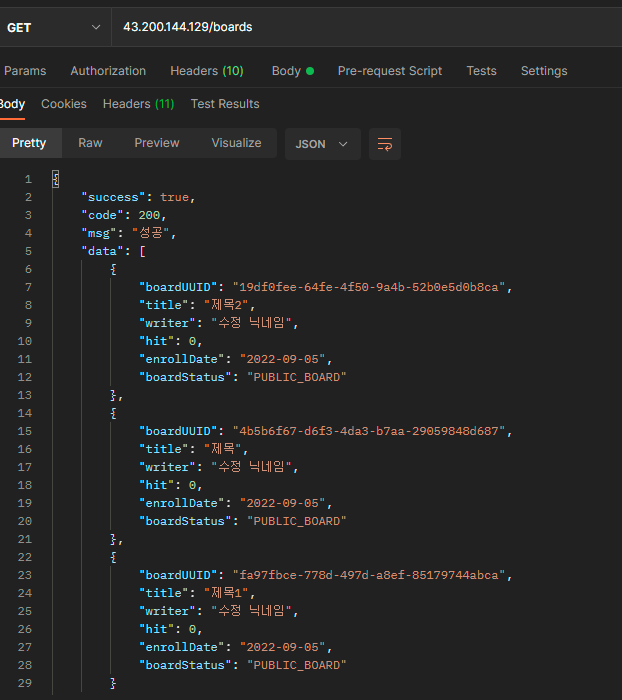
</p>

> * boardStatus가 PUBLIC_BOARD인 전체 게시글을 조회 할 수 있습니다.

<br/>

### 내가 작성한 게시글 전체 조회
  
```bash
Get 
* 내가 작성한 게시글 전체 조회 : 3.39.20.133/board/{이메일주소}
```
<p align="center">
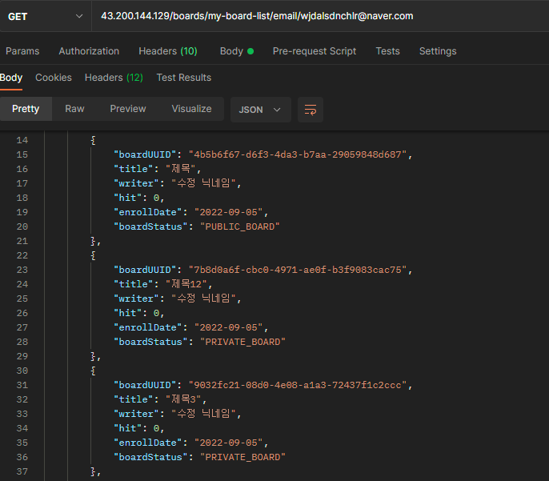
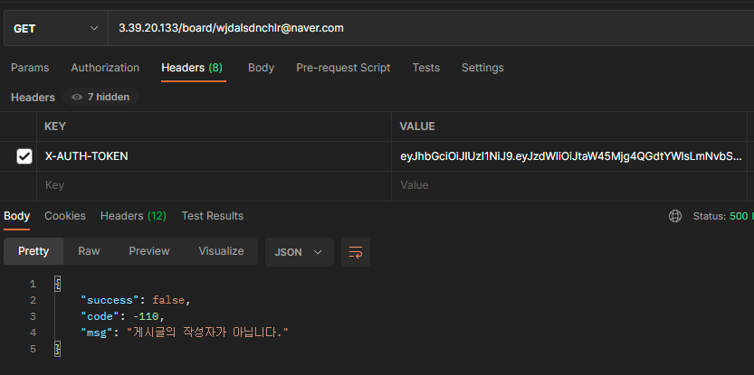
</p>

> * 내가 작성한 PUBLIC_BOARD, PRIVATE_BOARD 모두 조회를 할 수 있습니다.
> * 다만, 작성한 유저가 아닌 다른 유저가 내 게시물을 조회하려고 할 시 경고를 출력합니다.

<br/>

### 게시글 상세 조회
  
```bash
Get 
* 게시글 상세조회 : 3.39.20.133/board/detail/{게시글UUID}
```
<p align="center">
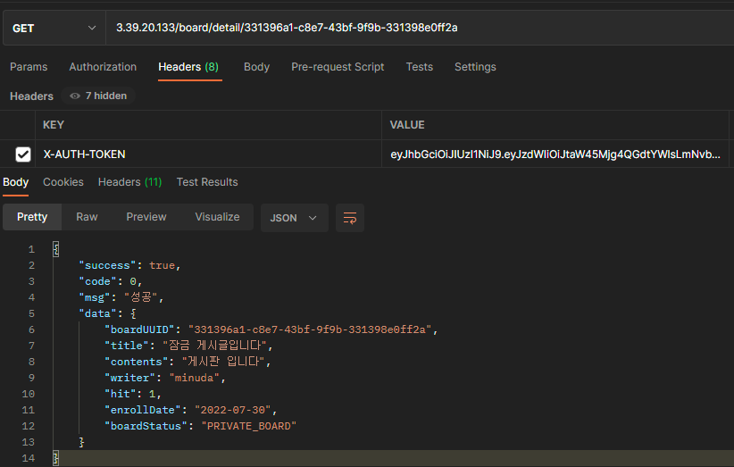
</p>

> * 전체 조회 / 내가 작성한 글 전체 조회의 Response 값에서 상세조회 하려는 게시글 UUID을 복사하여 사용하면 됩니다.
> * 게시물의 상세정보를 볼 수 있습니다. 
> * 조회 시, 조회수가 1 증가합니다.
> * PRIVATE_BOARD 게시물의 경우 본인이 아니면 조회 할 수 없습니다.
> * 작성한 유저가 아닌 다른 유저가 PRIVATE_BOARD 게시물을 조회하려고 할 시 경고를 출력합니다.

<br/>

### 게시글 수정
  
```bash
Put 
* 게시글 수정 : 3.39.20.133/board/update/{게시글UUID}

{
    "title" : "수정할 제목",
    "contents" : "내용",
    "boardStatus" : "PUBLIC_BOARD / PRIVATE_BOARD"
}
```
<p align="center">
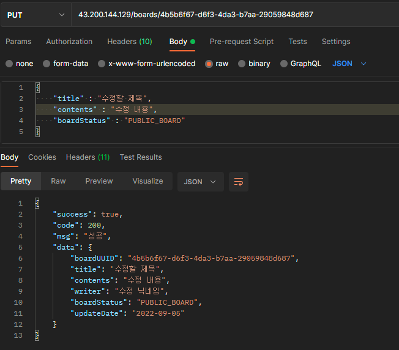
</p>

> * 내가 작성한 글을 수정할 수 있습니다.
> * boardStatus 도 수정이 가능하며, 여기서 게시글을 잠금해제하거나 잠금할 수 있습니다.
> * 타인이 내 게시글을 수정할려고 할 시, 경고가 출력됩니다.

<br/>

### 게시글 삭제
  
```bash
DELETE 
* 게시글 삭제 : 3.39.20.133/board/delete/{게시글UUID}
```
<p align="center">
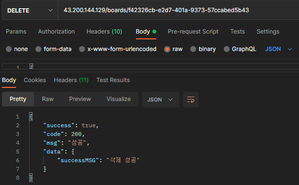
</p>

> * 내가 작성한 글을 삭제할 수 있습니다.
> * 타인이 내 게시글을 삭제할려고 할 시, 경고가 출력됩니다.

<br/>

## Spring Boot (API Server)
> 요청한 데이터를 JSON으로 response 합니다.

- 구조는 다음과 같습니다.
  - security : security, jwt 관련 기능들을 관리합니다.
  - exception : custom exception message들을 관리합니다.
  - web
    - controller : API를 관리합니다.
  - domain
    - dto : 도메인별 request / response DTO를 관리합니다.
    - entity : 도메인별 entity를 관리합니다.
    - repository : 도메인별 JPA / QueryDSL를 관리합니다.
    - service : 도메인별 business logic을 수행하고 repository를 이용해서 결과값을 처리합니다.

<br/>

## Spring Security (Security)
> Security 설정을 통해 인가된 사용자만 특정 API에 접근할 수 있도록 제한합니다.

- 구조는 다음과 같습니다.
  - Http basic Auth : disable -> REST API 이므로 기본설정 미사용
  - CSRF : disable  -> REST API이므로 CSRF 보안 미사용
  - Form Login : disable  -> REST API 이므로 Form Login 미사용
  - Session Creation Policy : STATELESS -> JWT로 인증하므로 세션 미사용
  - AuthorizeRequest : 
    - “ /api/sign/** ” : 회원가입 / 로그인 / 이메일 인증 / 토큰 관련 API를 허용합니다.
    - “ /exception/** ” - 예외처리 API를 허용합니다.
    - “ /test ” - 테스트 API를 허용합니다.
    - " /profile "  - profile API를 허용합니다.
    - " /actuator/** " - 애플리케이션 상태 확인을 위한 actuator API를 허용합니다. 
  - Token Authentication Filter : UsernamePasswordAuthenticationFilter.class -> JWT 필터 추가

<br/>

## JPA & QueryDSL (ORM)
> JPA를 사용하여 객체 중심 domain 설계 및 반복적인 CRUD 작업을 간단히 DB 데이터를 조회함으로써 대체합니다.
> JPA에서 해결할 수 없는 복합한 SQL문은 QueryDSL으로 작성합니다.

- 구조는 다음과 같습니다. (ex. board)
  - Board (Domain Class)
  - BoardRepository (JPA Interface)
  - BoardCustomRepository (QueryDSL Interface)
  - BoardCustomRepositoryImpl (QueryDSL Implements Class)
    - QueryDSL 사용예시
    ``` bash
      public List<Board> findAllMyBoard(String email) {
        List<Board> boardList = jpaQueryFactory.selectFrom(board)
                .where(board.writer.email.eq(email))
                .leftJoin(board.writer, member)
                .fetch();
        return boardList;
    }
    ```

<br/>

## Travis & Codedeploy & EC2 (CI/CD, Infra)
> * Travis CI 와 AWS Codedeploy를 통한 배포 자동화와 Nginx를 통한 무중단 배포를 구축하였습니다.
> * EC2의 SSH 접근권한은 제 IP만 허용했습니다.
> * 루트 계정이 아닌, IAM 계정에서 사용자를 생성하고 권한 부여를 통해서 보안성을 강화 하였습니다.


- 배포 구조는 다음과 같습니다.
<p align="center">
  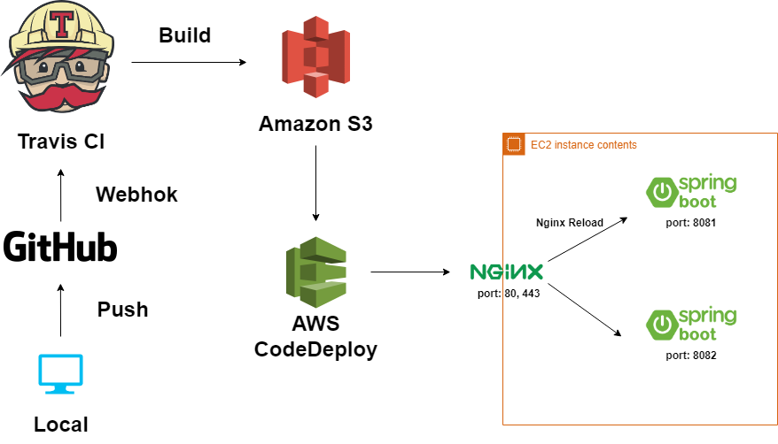
</p>

- EC2에서 Nginx와 스프링부트 JAR 2개를 사용하여 무중단 배포를 구현 하였습니다.
- Nginx에는 80(http), 443(https) 포트를 할당 하였습니다.
- 스프링부트1(profile : set1)은 8081 포트로, 스프링부트2(profile : set2)은 8082포트로 실행합니다. 
- Nginx와 연결된 스프링부트1(set1)이 구동 중 일 때, 배포를 하면 Nginx가 바라보고 있지 않은 스프링부트2(set2)에서 배포가 진행됩니다. 
- 배포가 끝나면 nginx reload를 통해 8081(set1) 대신 8082(set2)를 바라보게 합니다.
- 이러한 과정을 통해 배포시에도 서비스가 중단되지 않고 무중단 배포가 가능하게 됩니다. 


<br/>

## 패키지 구조

```bash

domain
  ㄴ board
      ㄴ dto
          ㄴ requestDTO
              ㄴ BoardUpdateRequestDTO.class
              ㄴ BoardWriteRequestDTO.class
          ㄴ responseDTO
              ㄴ BoardDeleteResponseDTO.class
              ㄴ BoardGetBoardListResponseDTO.class
              ㄴ BoardGetBoardResponseDTO.class
              ㄴ BoardUpdateResponseDTO.class
              ㄴ BoardWriteResponseDTO.class
      ㄴ entity
          ㄴ Board.class
          ㄴ enumPackage
              ㄴ BoardStatus.enum
      ㄴ repository
          ㄴ BoardCustomRepository.interface
          ㄴ BoardCustomRepositoryImpl.class
          ㄴ BoardRepository.interface
      ㄴ service 
          ㄴ BoardService.interface
          ㄴ BoardServiceImpl.class
  ㄴ email
      ㄴ dto
          ㄴ requestDTO
              ㄴ EmailAuthRequestDTO.class
      ㄴ entity
          ㄴ EmailAuth.class
      ㄴ repository
          ㄴ EmailAuthCustomRepository.interface
          ㄴ EmailAuthCustomRepositoryImpl.class
          ㄴ EmailAuthRepository.interface
      ㄴ service 
          ㄴ EmailService.class
  ㄴ member
      ㄴ dto
          ㄴ requestDTO
              ㄴ MemberLoginRequestDTO.class
              ㄴ MemberRegisterRequestDTO.class
              ㄴ TokenRequestDto.class
          ㄴ responseDTO
              ㄴ MemberGetInfoResponseDTO.class
              ㄴ MemberLoginResponseDTO.class
              ㄴ MemberRegisterResponseDTO.class
              ㄴ TokenResponseDTO.class
      ㄴ entity
          ㄴ Member.class
          ㄴ enumPackage
              ㄴ Role.enum
      ㄴ repository
          ㄴ MemberRepository.interface
      ㄴ service 
          ㄴ MemberService.interface
          ㄴ MemberServiceImpl.class
          ㄴ SingService.class
  ㄴ response
      ㄴ service 
          ㄴ ResponseService.class
  ㄴ response
      ㄴ service 
          ㄴ ResponseService.class
  ㄴ result
      ㄴ MultipleResult.class
      ㄴ Result.class
      ㄴ SingleResult.class
exception
  ㄴ AuthenticationEntryPointException.class
  ㄴ BoardDeleteFailureException.class
  ㄴ BoardNotFoundException.class
  ㄴ EmailAuthTokenNotFountException.class
  ㄴ EmailNotAuthenticatedException.class
  ㄴ InvalidRefreshTokenException.class
  ㄴ LoginFailureException.class
  ㄴ MemberDoNotUseOtherThingException.class
  ㄴ MemberEmailAlreadyExistsException.class
  ㄴ MemberNicknameAlreadyExistsException.class
  ㄴ MemberNotFoundException.class
  ㄴ MemberNotWriterException.class
  ㄴ ProcessFailureException.class
  ㄴ advise
      ㄴ ExceptionAdvice.class
security
  ㄴ accessDeniedHandler
      ㄴ CustomAccessDeniedHandler.class
  ㄴ authenticationEntryPoint
      ㄴ CustomAuthenticationEntryPoint.class
  ㄴ jwt
      ㄴ JwtAuthenticationFilter.class
      ㄴ JwtTokenProvider.class
  ㄴ member
      ㄴ MemberDatails.class
      ㄴ MemberDetailsService.class
  ㄴ util
      ㄴ SecurityUtil.class
  ㄴ SecurityConfig.class
web
  ㄴ controller
      ㄴ board
          ㄴ BoardController.class
      ㄴ exception
          ㄴ ExceptionController.class
      ㄴ member
          ㄴ MemberController.class
          ㄴ SignController.class
      ㄴ profile
          ㄴ ProfileController.class
          
```
